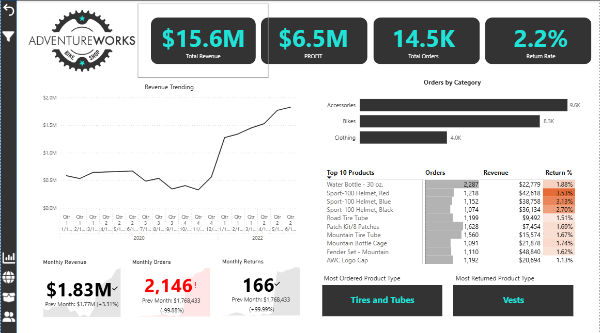
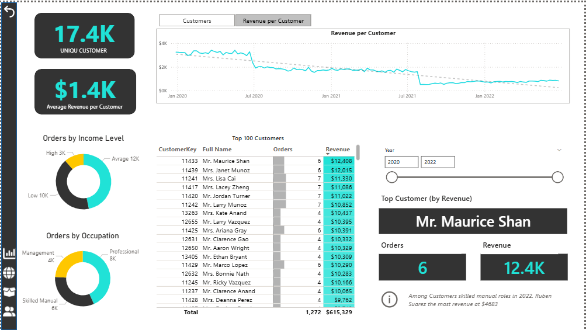
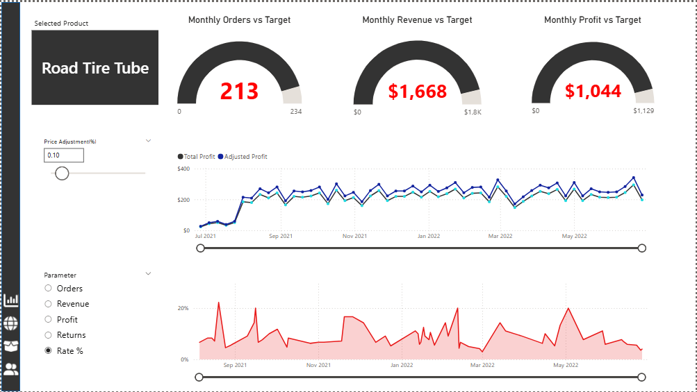
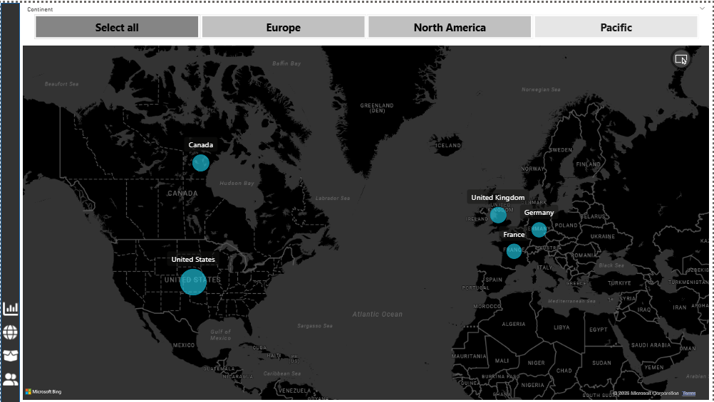

# AdventureWorks Sales Dashboard (Power BI)

## 📊 Overview
This project is a multi-page Power BI dashboard built using the AdventureWorks dataset to analyze sales performance, customer insights, and product trends.

## 🚀 Features
- Executive Dashboard with KPIs (Revenue, Profit, Orders, Return Rate)
- Customer Analysis (Top customers, revenue trends, segmentation)
- Product Analysis (Top products, return rates, category performance)
- Interactive filters and drill-through functionality
- Parameter-based analysis for dynamic insights

## 🛠 Tools & Technologies
- Power BI
- DAX
- Data Modeling

## 📌 Key Insights
- Revenue shows steady growth over time
- High return rates observed in specific product categories
- Top customers contribute significantly to overall sales

## 📸 Dashboard Preview

## 📁 Files
- AdventureWorks.pbix
